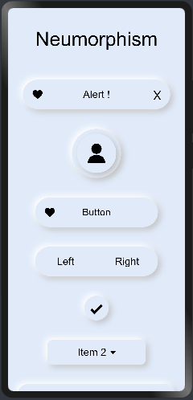
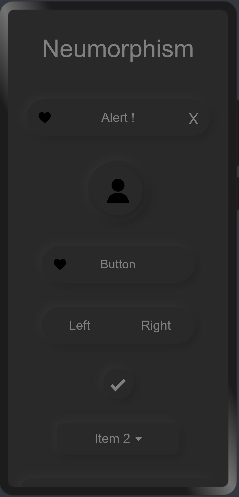
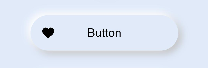
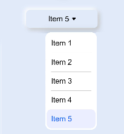
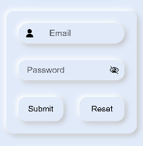
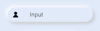
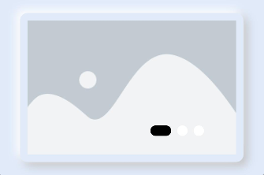

# neumorphism
一Neumorphism for OpenHarmony.

## Download & Install

```javascript
npm i hmos-neumorphism
```

Details about OpenHarmony NPM environment configuration, see at [here](https://gitee.com/openharmony-tpc/docs/blob/master/OpenHarmony_npm_usage.md)

## Usage Instructions

    Note :
    Add this css snippet when passing input or button through slot .
    
    button, input{
        width: 100%;
        height: 100%;
        background-color:transparent;
        color: black;
    }
    Import all components at once
    <element name='neutheme' src='hmos-neumorphism/theme/theme.hml'></element>
    <element name='neualert' src='hmos-neumorphism/alert/alert.hml'></element>
    <element name='neuavatar' src='hmos-neumorphism/avatar/avatar.hml'></element>
    <element name='neubutton' src='hmos-neumorphism/button/button.hml'></element>
    <element name='neubuttons' src='hmos-neumorphism/buttons/buttons.hml'></element>
    <element name='neucard' src='hmos-neumorphism/card/card.hml'></element>
    <element name='neucheckbox' src='hmos-neumorphism/checkbox/checkbox.hml'></element>
    <element name='neudropdown' src='hmos-neumorphism/dropdown/dropdown.hml'></element>
    <element name='neuform' src='hmos-neumorphism/form/form.hml'></element>
    <element name='neuinput' src='hmos-neumorphism/input/input.hml'></element>
    <element name='neulabel' src='hmos-neumorphism/label/label.hml'></element>
    <element name='neunavbar' src='hmos-neumorphism/navbar/navbar.hml'></element>
    <element name='neupagination' src='hmos-neumorphism/pagination/pagination.hml'></element>
    <element name='neuprogress' src='hmos-neumorphism/progress/progress.hml'></element>
    <element name='neuradio' src='hmos-neumorphism/radio/radio.hml'></element>
    <element name='neuswitcher' src='hmos-neumorphism/switcher/switcher.hml'></element>
    <element name='neucarousel' src='hmos-neumorphism/carousel/carousel.hml'></element>
    
  # Theme

<p float="left">



</p>
      
    
    Import:
    
    <element name='neutheme' src='hmos-neumorphism/theme/theme.hml'></element>
    Usage:
    
    <!--You can choose between following themes:-->
    
    <!--white-->
    <!--silver-->
    <!--gray-->
    <!--black-->
    <!--red-->
    <!--maroon-->
    <!--yellow-->
    <!--olive-->
    <!--lime-->
    <!--green-->
    <!--aqua-->
    <!--teal-->
    <!--blue-->
    <!--navy-->
    <!--pink-->
    <!--purple-->
    
    <neutheme theme="silver" text="black">
    </neutheme>
    
  # Alert


    
    Import:
    
    <element name='neualert' src='hmos-neumorphism/alert/alert.hml'></element>
    Usage:
    
    <neualert icon="common/icons/heart.png" width="300px" height="60px" border="40px" >
      <text>Alert !</text>
    </neualert>
   
  # Avatar

 
    
    Import:
    
    <element name='neuavatar' src='hmos-neumorphism/avatar/avatar.hml'></element>
    Usage:
    
    <neuavatar icon="common/icons/user.png" width="100px" height="100px" border="50px"></neuavatar>
    
  # Button


    
    Import:
    
    <element name='neubutton' src='hmos-neumorphism/button/button.hml'></element>
    Usage:
    
    <neubutton icon="common/icons/heart.png" width="250px" height="60px" border="50px" @button-event="buttonClick">
      <text>Button</text>
    </neubutton>
    
  # Buttons


    
    Import:
    
    <element name='neubuttons' src='hmos-neumorphism/buttons/buttons.hml'></element>
    Usage:
    
    <neubuttons  width="250px" height="60px" border="50px">
      <button slot="first" onclick="buttonLeftClick">Left</button>
      <button slot="second" onclick="buttonRightClick">Right</button>
    </neubuttons>
    
  # Card


    
    
    Import:
    
    <element name='neucard' src='hmos-neumorphism/card/card.hml'></element>
    Usage:
    
    <neucard width="300px" height="200px" border="10px" >
      <image src="common/placeholder.png" ></image>
    </neucard>
    
  # Checkbox


    
    
    Import:
    
    <element name='neucheckbox' src='hmos-neumorphism/checkbox/checkbox.hml'></element>
    Usage:
    
    <neucheckbox color="" width="50px" height="50px" border="50px" checked="true" @check-event="checkboxClick"></neucheckbox>
    
  # Dropdown


    
    
    Import:
    
    <element name='neudropdown' src='hmos-neumorphism/dropdown/dropdown.hml'></element>
    Usage:
    
    <neudropdown width="200px" height="50px" border="10px" @change-event="dropdownSelect">
      <select @change="dropdownSelect">
        <option value="Item 1">Item 1</option>
        <option value="Item 2">Item 2</option>
        <option value="Item 3">Item 3</option>
        <option value="Item 4">Item 4</option>
        <option value="Item 5" selected="true">Item 5</option>
      </select>
    </neudropdown>
    
  # Form


    
    
    Import:
    
    <element name='neuform' src='hmos-neumorphism/form/form.hml'></element>
    Usage:
    
    <neuform width="350px" height="300px" border="20px" @submit-event="buttonClick" @reset-event="buttonClick">
     <neuinput icon="common/icons/user.png" type="email" maxlength="20" placeholder="Email" border="30px"></neuinput>
     <neuinput icon="" type="password" maxlength="20" placeholder="Password" border="20px"></neuinput>
     <div>
      <neubutton icon="" width="150px" border="20px">
       <input type='submit' style="border-radius:20px;">Submit</input>
      </neubutton>
      <neubutton icon="" width="150px" border="20px">
       <input type='reset' style="border-radius:20px;">Reset</input>
      </neubutton>
     </div>
    </neuform>
    
  # Input


    
    
    Import:
    
    <element name='neuinput' src='hmos-neumorphism/input/input.hml'></element>
    Usage:
    
    <neuinput icon="common/icons/user.png" type="text" maxlength="20" placeholder="Input" width="300px" height="50px" border="50px" ></neuinput>
    
  # Label


    
    
    Import:
    
    <element name='neulabel' src='hmos-neumorphism/label/label.hml'></element>
    Usage:
    
    <neulabel text="Label" icon="common/icons/heart.png" width="200px" height="50px" border="50px" ></neulabel>
    
  # Navbar


    
    
    Import:
    
    <element name='neunavbar' src='hmos-neumorphism/navbar/navbar.hml'></element>
    Usage:
    
    <neunavbar  width="300px" height="50px" border="50px" @right-event="buttonClick" @middle-event="buttonClick" @left-event="buttonClick">
      <image slot="first" src="common/icons/recent.png" style="width:20px; height: 20px;" ></image>
      <image slot="second" src="common/icons/home.png" style="width:20px; height: 20px;" ></image>
      <image slot="third" src="common/icons/return.png" style="width:20px; height: 20px;" ></image>
    </neunavbar>
    
  # Pagination


    
    
    Import:
    
    <element name='neupagination' src='hmos-neumorphism/pagination/pagination.hml'></element>
    Usage:
    
    <neupagination color="" width="300px" height="50px" border="50px"  @previous-event="previousEvent" @next-event="nextEvent">
      <button>1</button>
      <button>2</button>
      <button>3</button>
      <button>4</button>
      <button>5</button>
    </neupagination>
    
  # Progress


    
    
    Import:
    
    <element name='neuprogress' src='hmos-neumorphism/progress/progress.hml'></element>
    Usage:
    
    <neuprogress progress="80%" width="300px" color="" height="20px" border="50px"></neuprogress>
    
  # Radio


    
    
    Import:
    
    <element name='neuradio' src='hmos-neumorphism/radio/radio.hml'></element>
    Usage:
    
    <neuradio width="50px" color="" height="50px" border="50px" checked="" @check-event="radioClick"></neuradio>
    
  # Switcher


    
    
    Import:
    
    <element name='neuswitcher' src='hmos-neumorphism/switcher/switcher.hml'></element>
    Usage:
    
    <neuswitcher width="60px" color="" height="30px" border="50px" toggle="off" @toggle-event="toggleClick"></neuswitcher>
    
  # Carousel


    
    
    Import:
    
    <element name='neucarousel' src='hmos-neumorphism/carousel/carousel.hml'></element>
    Usage:
    
    <neucarousel width="300px" height="200px" color="black" border="10px" index="0" indicator="true" loop="true">
                <image src="common/placeholder.png" ></image>
                <image src="common/placeholder.png" ></image>
                <image src="common/placeholder.png" ></image>
            </neucarousel>


## Compatibility
Supports OpenHarmony API version 6 

## Directory Structure
````
|---- Neumorphism  
|     |---- entry  # sample app usage
|     |---- Neumorphism  # Neumorphism library
|           |---- alert  # Alert Component
|                 |---- alert.css  # Alert style component
|                 |---- alert.hml  # Alert hml file
|                 |---- alert.js  # Alert JS
|           |---- avatar  # Avatar Component
|                 |---- avatar.css  # Avatar style component
|                 |---- avatar.hml  # Avatar hml file
|           |---- button  # Button Component
|                 |---- button.css  # Button style component
|                 |---- button.hml  # Button hml file
|                 |---- button.js  # Button JS
|           |---- buttons  # Buttons Component
|                 |---- buttons.css  # Buttons style component
|                 |---- buttons.hml  # Buttons hml file
|           |---- card  # Card Component
|                 |---- card.css  # Card style component
|                 |---- card.hml  # Card hml file
|           |---- carousel  # Carousel Component
|                 |---- carousel.css  # Carousel style component
|                 |---- carousel.hml  # Carousel hml file
|           |---- checkbox  # Checkbox Component
|                 |---- checkbox.css  # Checkbox style component
|                 |---- checkbox.hml  # Checkbox hml file
|                 |---- checkbox.js  # Checkbox JS
|           |---- dropdown  # Dropdown Component
|                 |---- dropdown.css  # Dropdown style component
|                 |---- dropdown.hml  # Dropdown hml file
|           |---- form  # Form Component
|                 |---- form.css  # Form style component
|                 |---- form.hml  # Form hml file
|                 |---- form.js  # Form JS
|           |---- input  # Input Component
|                 |---- input.css  # Input style component
|                 |---- input.hml  # Input hml file
|           |---- label  # Label Component
|                 |---- label.css  # Label style component
|                 |---- label.hml  # Label hml file
|           |---- navbar  # Navigation Bar Component
|                 |---- navbar.css  # Navigation Bar style component
|                 |---- navbar.hml  # Navigation Bar hml file
|                 |---- navbar.js  # Navigation Bar JS
|           |---- pagination  # Pagination Component
|                 |---- pagination.css  # Pagination style component
|                 |---- pagination.hml  # Pagination hml file
|                 |---- pagination.js  # Pagination JS
|           |---- progress  # Progress Component
|                 |---- progress.css  # Progress style component
|                 |---- progress.hml  # Progress hml file
|           |---- radio  # Radio Component
|                 |---- radio.css  # Radio style component
|                 |---- radio.hml  # Radio hml file
|                 |---- radio.js  # Radio JS
|           |---- switcher  # Switcher Component
|                 |---- switcher.css  # Switcher style component
|                 |---- switcher.hml  # Switcher hml file
|                 |---- switcher.js  # Switcher JS
|           |---- theme  # Theme Component
|                 |---- theme.css  # Theme style component
|                 |---- theme.hml  # Theme hml file
|     |---- README.MD  # installation and usage                   
````

## Code Contribution
If you find any problems during usage, you can submit an [Issue](https://gitee.com/openharmony-sig/Neumorphism/issues) to us. Of course, we also welcome you to send us [PR](https://gitee.com/openharmony-sig/Neumorphism/pulls).

## Open source License
This project is based on [Apache License 2.0](https://gitee.com/openharmony-sig/Neumorphism/blob/master/LICENSE.txt) ，please enjoy and participate in open source freely.

